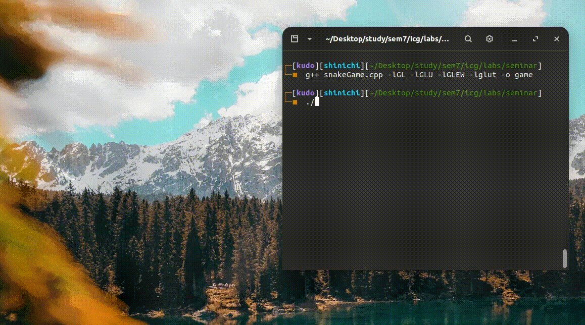

# opengl-snakegame
A simple 2d snake game made using opengl in c++. This version is a porting from OpenGL 2.0 to OpenGL 4.0 of the original forked version.
This game was realized for the course "Fondamenti di Computer Graphics M" held by professor Serena Morigi at the University of Bologna.

## Demo



## Keyboard Controls
* P - To resume/start or pause the game
* R - To restart the game
* W - To move up
* A - To go left
* S - To go down
* D - To go right
* Esc or Q - To Exit

## Keyboard Controls currently not available
* M - To change difficulty
* H - For help
* +/- - To change map size

## Compilation and Execution
To Compile
```
g++ Snake.cpp ShaderMaker.cpp -lglut -lGL -lGLEW -lGLU -o Snake
```
To run
```
./game
```

## Dependencies
For Ubuntu
```
 sudo apt install binutils-gold  g++ mesa-common-dev build-essential libglew1.5-dev libglm-dev
 ```
 ```
 sudo apt install mesa-utils
 ```
 ```
 sudo apt-get install libglu1-mesa-dev freeglut3-dev mesa-common-dev
```

